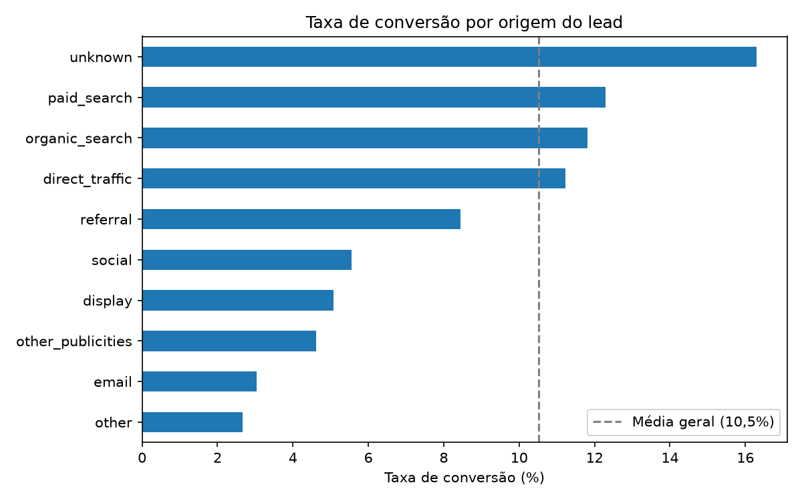

# Funil comercial da Olist: conversão de leads por canal

Análise do funil de vendas B2B da Olist, marketplace brasileiro que recruta vendedores para a sua plataforma. O objetivo é identificar quais canais de aquisição trazem os leads que mais viram negócio fechado.

## Pergunta de negócio

Quais origens de lead convertem acima da média, e onde estão os pontos de atenção do funil?

## Dados

[Marketing Funnel by Olist](https://www.kaggle.com/datasets/olistbr/marketing-funnel-olist), no Kaggle. Licença CC BY-NC-SA 4.0.

- `olist_marketing_qualified_leads_dataset.csv`: 8.000 leads qualificados (MQLs), com data de contato e origem
- `olist_closed_deals_dataset.csv`: 842 negócios fechados, com segmento, tipo de lead e vendedor responsável

As duas tabelas foram unidas pelo `mql_id` (left join), mantendo todos os leads para calcular a taxa de conversão.

## Principais achados

**Taxa geral de conversão: 10,5%** (842 negócios em 8.000 leads), ou cerca de 8,5 leads para cada negócio fechado.



**Canais fortes**
- `organic_search`: 2.296 leads, 11,8% de conversão (maior volume)
- `paid_search`: 1.586 leads, 12,3% de conversão
- `direct_traffic`: 499 leads, 11,2% de conversão

`paid_search` e `organic_search` estão praticamente empatados em taxa. A diferença está no volume, que é maior no orgânico.

**Pontos de atenção**
- **Origem não rastreada:** o grupo com maior conversão (`unknown`, 1.099 leads, 16,3%) não tem a origem identificada. Corrigir o rastreamento é a recomendação prioritária, para descobrir de onde vêm os melhores contatos.
- **Social com baixa qualidade de lead:** 1.350 leads, mas apenas 5,6% de conversão, cerca de metade da média.

**Composição dos negócios fechados**  
Os 4 maiores segmentos concentram 41% dos negócios: `home_decor`, `health_beauty`, `car_accessories` e `household_utilities`.

## Limitações

- O dataset não tem custo por canal, então não é possível recomendar onde investir com base em retorno.
- O segmento de negócio só é registrado após o fechamento, o que impede calcular a conversão por segmento.

## Próximos passos

- Cruzar com o dataset de pedidos da Olist para segmentar os vendedores por desempenho (RFM)
- Analisar o tempo entre o primeiro contato e o fechamento
- Avaliar o desempenho por SDR e por vendedor

## Como rodar

```bash
python3 -m venv .venv
source .venv/bin/activate
pip install -r requirements.txt
jupyter lab
```
Abra o `01_exploracao.ipynb` e rode todas as células.

## Ferramentas

Python, pandas, matplotlib, Jupyter
